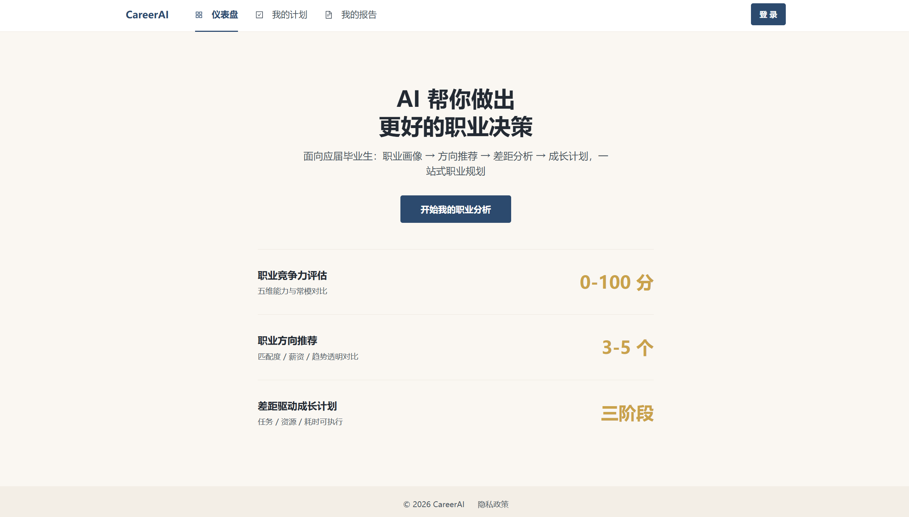
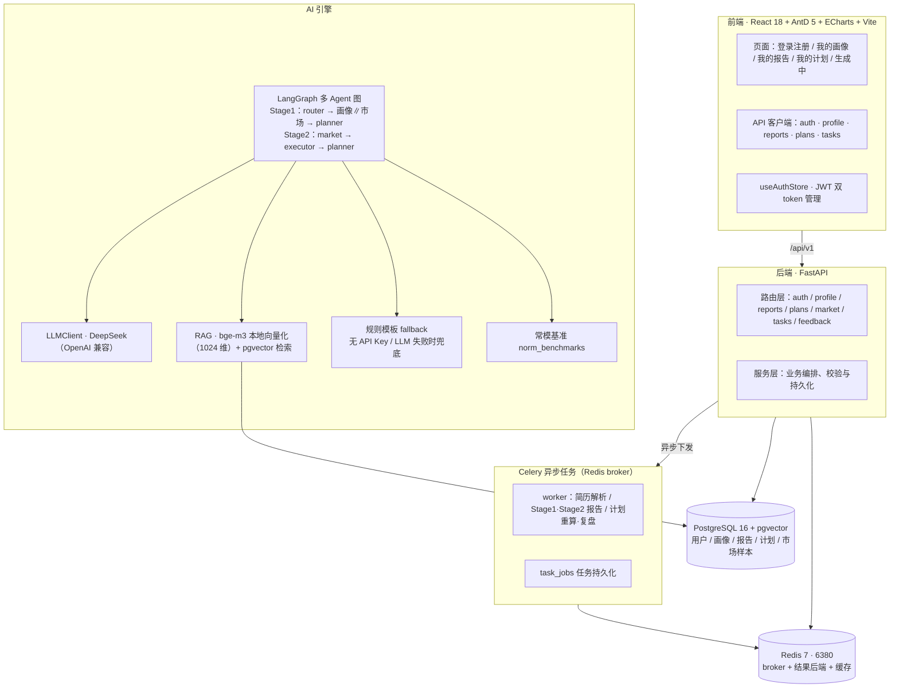

# CareerAI —— AI 驱动的职业竞争力分析与成长规划平台

> **一句话定位**：上传一份简历，AI 在几分钟内完成职业画像、方向推荐、差距分析与成长计划 —— 一个完全跑在本地、可端到端演示的 AI 职业分析平台。

CareerAI 以「简历解析 → 职业画像 → 方向推荐 → 差距分析 → 成长计划」为主线，将 DeepSeek 大模型、LangGraph 多 Agent 编排与本地 RAG 检索组合成一条可解释的分析流水线，所有耗时任务通过 Celery 异步执行，并内置规则模板降级机制——即使不配置 DeepSeek API Key，文本简历的「上传 → 画像 → 报告 → 计划」完整链路仍可演示；图片/扫描件简历需 GLM API Key 或手动补填。



---

## 目录

- [核心功能](#核心功能)
- [模块架构](#模块架构)
- [技术亮点](#技术亮点)
- [快速启动](#快速启动)
- [演示路径](#演示路径)
- [启动故障排查](#启动故障排查)
- [技术栈一览](#技术栈一览)
- [开发者：添加市场数据](#开发者添加市场数据)
- [测试与质量](#测试与质量)
- [已知限制](#已知限制)

---

## 核心功能

1. **账号注册 / 登录**：JWT 双 token 认证（access 30 分钟 + refresh 7 天），bcrypt 密码哈希，前端统一由 `useAuthStore` 管理登录态。
2. **简历上传与解析**：文本型 PDF 通过 PyMuPDF 提取；图片 / 扫描件通过 GLM 视觉模型（`glm-4.6v-flash`）OCR 并结构化，解析结果自动生成职业画像；未配置视觉模型时引导用户通过表单手动补填。
3. **职业竞争力画像**：多维能力评分 + 常模基准对照（`norm_benchmarks`），以雷达图 / 箱线图直观呈现个人在目标人群中的位置。
4. **职业方向推荐（Stage1 报告）**：LangGraph 多 Agent 并行分析「个人画像」与「市场数据」，推荐适配方向并给出可解释的理由与置信度。
5. **差距分析与成长计划（Stage2 报告）**：针对目标岗位逐项拆解能力差距，输出分阶段成长计划，并支持复盘与计划重算。
6. **市场数据浏览**：行业 × 城市线级真实市场数据（458 条 2026Q2，覆盖 11 个专业大类；含互联网行业岗位（官方统计补薪资 + 公开招聘补技能/学历/职责），支持检索与分面浏览。
7. **异步任务保障**：简历解析、报告生成、计划重算全部走 Celery 异步队列并持久化任务状态（`task_jobs`），页面离开不取消，前端轮询进度实时展示。

---

## 模块架构



> 说明：图中模块均已在代码中落地。市场数据为 458 条真实可溯源数据（2026Q2：官方统计 354 条 + 公开招聘 76 条，另保留存量 28 条），详见[已知限制](#已知限制)。

---

## 技术亮点

### 1. LangGraph 多 Agent 编排

- **双图结构**：Stage1 报告图为 `router → (career_analysis ∥ market_research 并行) → planner`；Stage2 差距分析图为 `market → executor → planner`，各 Agent 职责单一、可独立替换。
- **节点级容错**：任一节点抛异常不终止整图，异常写入 `stage_errors`，由 Planner 节点标注兜底输出——单点失败不会让整份报告中断。
- **进度实时回调**：节点边界按进度映射上报，前端「生成中」页实时展示当前分析阶段。
- **整图看门狗**：整图执行有 180s 超时保护（`AI_WATCHDOG_SECONDS`），避免异常场景无限挂起。

### 2. 本地 RAG（bge-m3 + pgvector）

- **零 API 成本、数据不出本地**：使用 BAAI/bge-m3 本地向量化（1024 维，CPU 推理），向量检索由 PostgreSQL 的 pgvector 插件承担，无外部向量库依赖。
- **三级加载策略**：显式模型路径 → HuggingFace 本地缓存快照（命中即 `HF_HUB_OFFLINE=1` 离线加载）→ 在线下载，兼顾离线演示与首次便捷安装。
- **自动降级**：bge-m3 不可用时 RAG 检索降级为空，市场 Agent 仅使用 LLM 通用知识并如实标注「数据较少」，系统不崩溃。

### 3. 规则模板 fallback 降级

- 未配置 `DEEPSEEK_API_KEY` 时，`LLMClient.is_available` 为 false，简历解析、评分、建议、市场信息、报告组装、差距计划等全部 AI 环节自动切换为**规则模板兜底**，系统其余功能完全不受影响。
- 与 LangGraph 节点容错互补：真实 LLM 调用失败同样落回模板输出——**即使不配置 DeepSeek API Key，文本简历链路也能端到端演示**（图片/扫描件需 GLM API Key 或手动补填，详见[演示路径](#演示路径)）。

### 4. Celery 异步任务

- 简历解析、Stage1/Stage2 报告生成、计划重算与复盘等耗时任务全部异步化，通过 Redis broker 调度，API 秒级返回任务 ID，前端轮询进度。
- **任务持久化**：任务状态写入 `task_jobs`，用户离开页面后任务继续执行，重新进入仍可查询结果。
- 平台兼容性已处理：Windows 下 worker 使用 `--pool=solo` 运行。

### 5. JWT 双 token 认证

- 短效 access token（30 分钟）+ 长效 refresh token（7 天），HS256 签名（PyJWT），密码 bcrypt 哈希存储；服务端按 token 类型校验，过期/非法统一映射为明确的 401 错误码。默认 JWT 占位符 59 字节（≥32 字节，消除 PyJWT InsecureKeyLengthWarning），生产环境必须注入 ≥32 字节随机密钥。

---

## 快速启动

> 详细部署步骤见 [`DEPLOYMENT.md`](./DEPLOYMENT.md)。以下为推荐路径概览（容器化一键启动），默认端口：后端 `8000` / 前端 `5173` / PostgreSQL `5432` / Redis `6380`。

**前置要求**：Docker（compose v2.24+）——应用已容器化，无需本地 Python/Node 环境。

```powershell
# 从仓库根目录一键启动全部 5 个服务（PostgreSQL + Redis + backend API + celery worker + frontend）
.\start.ps1

# 停止（保留数据卷）
.\stop.ps1
```

启动后访问：
- 前端：<http://localhost:5173>
- 后端 API：<http://localhost:8000>（Swagger：<http://localhost:8000/docs>）
- 健康检查：<http://localhost:8000/health>

> 需要本地开发热重载 / 断点调试时，使用 `DEPLOYMENT.md` 中的**备选手动路径**（3 终端）。

## 演示路径

**注册 → 登录 → 我的画像 → 上传简历 → 查看画像 → 生成报告（Stage1 方向推荐）→ 差距分析 + 成长计划（Stage2）→ 查看 / 复盘计划**

3 分钟即可走通：注册账号 → 在「我的画像」上传一份文本型 PDF 简历 → 等待异步解析完成后查看自动生成的画像（可手动补填）→ 一键生成职业分析报告，查看方向推荐、差距分析与成长计划。

> **无 API Key 时的行为（重要）**：未配置 `DEEPSEEK_API_KEY` 时，系统自动进入规则模板 fallback 模式，报告内容为规则模板输出（非 LLM 生成），但「注册 → 上传文本型 PDF 简历 → 生成报告 → 查看报告/计划」的完整链路**仍然可以完整演示**；配置 API Key 后即为真实 LLM 生成的高质量报告，无需任何额外操作。

---

## 启动故障排查

| 现象 | 原因 | 处理方式 |
|------|------|---------|
| `docker compose ps` 无容器或状态 exited | Docker 未启动 / 未就绪 | 先启动 Docker Desktop，等待引擎就绪后重跑 `docker compose up -d`，并用 `docker compose ps` 确认 postgres / redis 均为 running（healthy） |
| 5432 / 6380 端口被占用 | 本机已有 PG / Redis | 修改 `docker-compose.yml` 端口映射，并同步 `backend/.env` 中 `DATABASE_URL` / `REDIS_URL` / `CELERY_*` |
| 8000 端口被占用 | 本机已有服务 / 容器映射冲突 | 手动：uvicorn 改用 `--port 8010`，并同步 `frontend/vite.config.ts` 中 `/api` 代理的 `target` 为 `http://localhost:8010`；容器化：修改 `docker-compose.yml` 的 backend 端口映射后重跑 `.\start.ps1` |
| 5173 端口被占用 | 本机已有前端 dev server | 修改 `frontend/vite.config.ts` 的 `server.port` |
| 任务一直停留在 pending | Celery worker 未启动 | 手动模式另开终端启动 worker（**Windows 必须 `--pool=solo`**）；容器化模式用 `docker compose logs celery` 检查 worker 是否正常消费 |
| 报告内容为模板风格 | `DEEPSEEK_API_KEY` 未配置 | 属预期 fallback 行为，不影响演示；配置 Key 后重启后端即为真实 LLM 报告 |
| RAG 检索为空 / bge-m3 相关报错 | bge-m3 模型未下载 | **自动降级**：RAG 检索降级为空，市场 Agent 仅用 LLM 通用知识并标注「数据较少」，系统正常可用；如需完整 RAG 能力，提前执行 `huggingface-cli download BAAI/bge-m3`（约 2GB，命中本地快照后离线加载）。注意：`DEBUG=true` 时 Embedding 切换为 Fake 伪嵌入（仅链路验证，勿用于真实数据） |
| 后端健康检查异常 | PG / Redis 未就绪 | 访问 `http://localhost:8000/health`，确认返回 `database: ok` 与 `redis: ok` |
| `backend/.env` 缺失 | 首次启动未生成 | `start.ps1` 会自动从 `backend/.env.example` 复制生成（默认 `DEBUG=true` → FakeEmbedding，避免加载 bge-m3 2GB 权重；`DEEPSEEK_API_KEY` 占位值自动置空 → 进入 fallback 模式） |
| 镜像拉取失败（`pull access denied` / `failed to resolve reference` / `dial tcp`） | 网络 / 代理 / 镜像源问题 | 检查网络与代理设置（Docker Desktop → Settings → Resources → Proxies），或配置镜像加速器后重试 |
| 镜像构建失败 / 后端容器启动即退出 | 依赖安装 / 前端构建 / 迁移失败 | `docker compose logs backend` / `logs frontend` / `logs celery` 查看构建与启动日志；前端构建失败检查 `frontend/src` 代码，后端依赖失败检查网络/源；后端启动即退出多为 `alembic upgrade head` 失败（fail-fast），按日志修复迁移或 `.env` 后重跑 `.\start.ps1` |
| 首次构建很慢 / 磁盘不足 | backend 镜像含 torch 约 2–3GB | 预留 8GB+ 磁盘；可用 `docker system prune` 清理旧镜像 |

---

## 技术栈一览

| 层 | 选型 |
|----|------|
| 前端 | React 18 + Ant Design 5 + ECharts 6 + Vite 6 + TanStack Query 5 + React Router 7 |
| 后端 | FastAPI + SQLAlchemy（asyncpg）+ Alembic（10 个迁移版本） |
| 数据库 | PostgreSQL 16 + pgvector（向量检索） |
| 异步 | Redis 7（broker / 结果后端 / 缓存）+ Celery |
| AI | DeepSeek（OpenAI 兼容 API）+ GLM 视觉（图片/扫描件 OCR）+ BAAI/bge-m3 本地向量化 + LangGraph 多 Agent |
| 认证 | PyJWT（双 token）+ bcrypt |

## 开发者：添加市场数据

RAG 检索使用的市场数据保存在 `backend/data/market_records_2026Q2.json`。开发者可以通过编辑该 JSON 并运行导入脚本来扩充数据。

### 数据字段

| 字段 | 必填 | 说明 |
|------|------|------|
| `job_title` | ✅ | 岗位名称 |
| `industry` | ✅ | 行业 |
| `city` | ✅ | 城市 |
| `city_tier` | ✅ | 城市线级：一线 / 新一线 / 二线 / 三线 / 四线及以下 |
| `salary_p25` / `salary_p50` / `salary_p75` | 可选 | 月薪分位（元/月），可空 |
| `trend` / `heat` | 可选 | 趋势 / 热度，无真实口径时置 `null` |
| `required_skills` | 可选 | 技能数组 |
| `education_requirement` | 可选 | 学历要求：不限 / 大专 / 本科 / 硕士 / 博士（可带“及以上”） |
| `responsibilities` | 可选 | 岗位职责字符串数组 |
| `data_source` | ✅ | 数据来源，需可溯源 |
| `confidence` | 可选 | 置信度 0~1 |
| `data_quarter` | ✅ | 数据季度，如 `2026Q2` |
| `source_type` | ✅ | `official_stat`（官方统计）或 `job_post`（公开招聘）；禁止 `ai_infer` |
| `source_occupation` | 可选 | 原始职业名称 |
| `category` | 可选 | 专业大类，如 `计算机类` |
| `source_batch` | 可选 | 数据批次标识，如 `internet-job`、`official-stat` |

### 导入步骤

1. 编辑 `backend/data/market_records_2026Q2.json`，按上述字段追加记录；
2. 在 `backend/` 目录执行：

   ```powershell
   python scripts/seed_market_data.py
   ```

3. 脚本会校验、去重、写入 PostgreSQL 并生成向量。

常用参数：

- `--dry-run`：只校验和预演，不写库
- `--force`：全量重建（删除本 JSON 覆盖记录后重插）
- `--no-embed`：跳过向量化
- `--backfill-source-type`：回填 `source_type`（旧库升级用）

> 真实向量化需要 `DEBUG=false` 并加载 bge-m3；`DEBUG=true` 时使用 FakeEmbedding，仅用于链路验证。

## 测试与质量

- 后端：pytest 全量测试（`backend/tests/`，测试中隔离数据库/Redis/LLM，零 Docker 依赖）**393 用例全过**；ruff check . 0 errors（全仓库检查，`backend/pyproject.toml`）。
- 前端：Vitest 108 用例（18 个测试文件，覆盖组件 + 工具函数 + 路由懒加载回归）+ ESLint 0 errors / 0 warnings + `npm run typecheck` + `npm run build` 全部通过（bundle 无 >500 kB chunk 警告）。
- AI 评估：`python -m scripts.eval_rag`（RAG 检索 recall@k / 命中率）与 `python -m scripts.eval_report_quality`（报告字段完整性校验），无 API Key / 模型权重时自动降级 mock 可运行。
- CI：`.github/workflows/business-ci.yml` 在 push/PR 时自动执行后端 pytest + ruff、前端 lint/typecheck/test/build。

## 已知限制

- **市场数据为 458 条真实数据**（2026Q2）：官方统计 354 条来自广东/嘉兴/河南/山东/京山/江苏/川渝/芜湖/东莞/济南/温州/杭州等人社部门薪酬调查年报（含山东/济南「数字经济（数字）职业细类」IT 职业工资价位）；公开招聘 76 条（ncss 国家大学生就业服务平台等 33 条 + 互联网行业 JD 43 条，来自猎聘/智联/高校就业信息网/全职招聘网等，覆盖后端/前端/算法/数据/测试/运维/产品/设计/运营/架构/网络安全等岗位，含 `education_requirement`（学历要求）与 `responsibilities`（职责）字段）；另保留存量 28 条可溯源记录。覆盖 11 个专业大类（计算机/经济金融/工商管理/教育/机械/电气/土木/医学/法学/艺术设计/新闻传播），数据血缘见 `backend/data/market_source_manifest.md`。
- **简历解析**：文本型 PDF 走 PyMuPDF；图片 / 扫描件依赖 GLM 视觉模型（需配置 `GLM_API_KEY`），未配置时解析失败并引导手动补填画像。
- **本地运行版本**：公网部署、Nginx/HTTPS、日志监控暂未包含，属于后续规划；CI 已内置（GitHub Actions）。
- **桌面浏览器优先**：桌面端已做 bundle 优化（无 >500 kB chunk 警告），Mobile 性能口径尚未达标，桌面端体验最佳。
